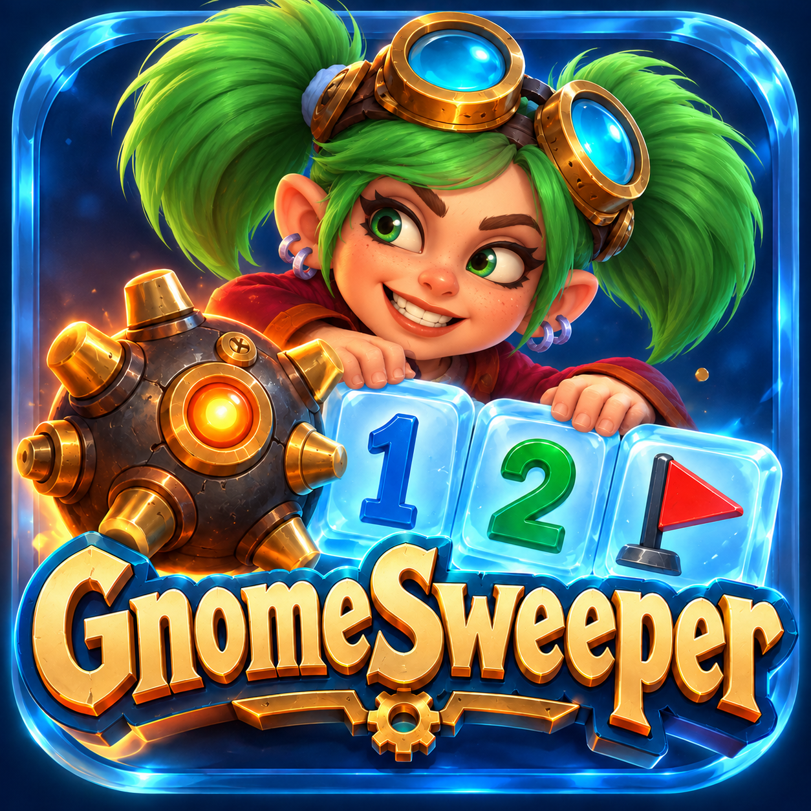
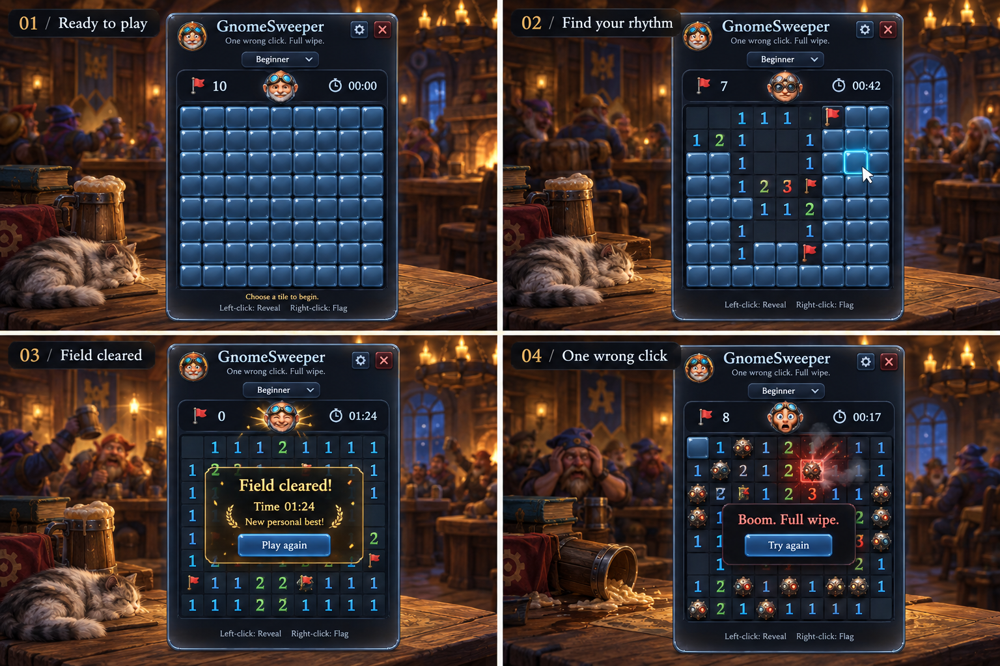

# Gnomesweeper — Minesweeper Forever

*One wrong click. Full wipe.*

Classic Minesweeper for World of Warcraft: Forever, in liquid glass with gnomish details.
`/gsweep`, `/gnomesweeper` or `/minewipe` to play.

**Download:** [CurseForge](https://www.curseforge.com/wow/addons/gnomesweeper).

## What's in it

- Beginner, Intermediate and Expert, with Windows XP's rules and a safe first click.
- Your best time at each difficulty, a clock that warns you as you near it, and fireworks when you beat it.
- A gnome who reacts to every move, Gnomeregan's sounds and (optionally) its music.
- Two looks for the board, Classic and Modern.
- Hides itself in combat and comes back after (a setting); a minimap button, a key binding.

## Found a bug? Have an idea?

Gnomesweeper is made and tested by one person on one setup, so **your reports are how problems
on other setups get found**: [open an issue](https://github.com/Spotnick2/Gnomesweeper/issues/new/choose).
A Lua error (`/console scriptErrors 1`, or BugSack) and a screenshot help the most.

## Development

See [docs/PLAN.md](docs/PLAN.md); the art direction is [docs/ART.md](docs/ART.md). The working notes
for contributors (and AI agents) are in [CLAUDE.md](CLAUDE.md).

## Licence

MIT — see [LICENSE](LICENSE).
